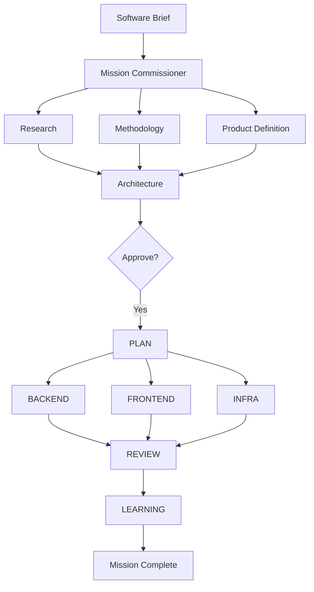
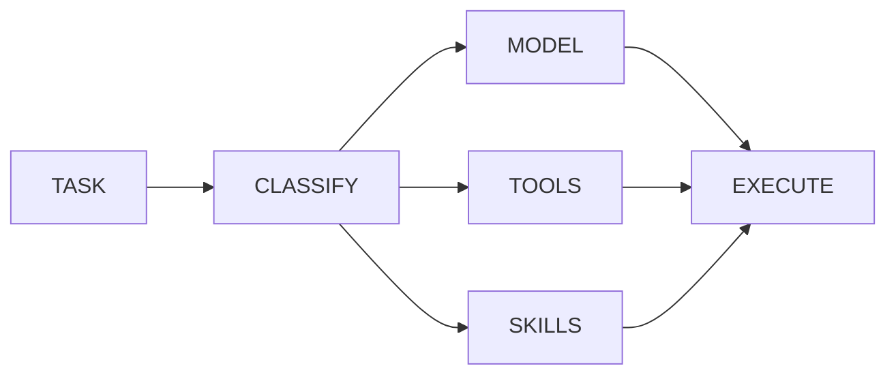
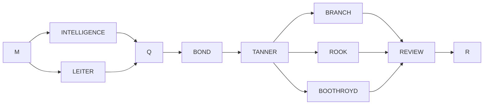

# CRESSIDA

<div align="center">

# 🕵️ CRESSIDA
### Autonomous Multi-Agent Software Engineering Framework

**Transform a plain-English software brief into production-ready software.**

Research • Architecture • Planning • Implementation • Review • Learning


[](docs/)
[](LICENSE)
[]
[]

Supports **Claude Code • OpenAI • Anthropic • Gemini • Groq • Ollama**

</div>

---

# Why CRESSIDA?

Modern coding agents are incredibly capable—but they're still **single engineers**.

They don't:

- coordinate specialists
- execute work in parallel
- optimize tool usage
- reuse experience
- stop themselves before making bad architectural decisions

CRESSIDA does.

Instead of one AI assistant, CRESSIDA acts as an autonomous software engineering organization.

---

# Demo

```bash
cressida run build_url_shortener.md
```

```
Mission Started

✓ Research
✓ Methodology Scan
✓ Product Definition
✓ Architecture
✓ Human Approval Gate
✓ Planning
✓ Backend Implementation
✓ Frontend Implementation
✓ Infrastructure
✓ Review
✓ Learning

Mission Complete
```


---

# Architecture



---

# Why CRESSIDA Is Different

## 🧠 Self Improving

Every completed mission improves future missions.

Agents build playbooks from successful executions and continuously refine their behavior.

---

## ⚡ Parallel Execution

Tasks execute simultaneously whenever dependencies allow.

Research and methodology happen together.

Backend, frontend and infrastructure can build in parallel.

---

## 🎯 Dynamic Tool Selection

Instead of giving every agent every tool...

CRESSIDA exposes only the smallest toolset required for each task.

Less context.

Less tokens.

Less noise.

---

## 💰 Token Efficient

Every task receives:

- the smallest suitable model
- only relevant tools
- only relevant skills

before execution begins.

---

## 🌍 Provider Agnostic

Run on

- Claude Code
- Anthropic
- OpenAI
- Gemini
- Groq
- Ollama
- OpenCode

without changing your workflow.

---

## 🛡 Human Approval Gates

BOND reviews every architecture before implementation.

Plans can

- proceed
- be rejected
- escalate to a human

before code is written.

---

# Commissioning Layer

Traditional Agent

```text
Task

↓

All tools

↓

All skills

↓

Largest model

↓

Execute
```

CRESSIDA

```text
Task

↓

Classify

↓

Smallest model

↓

Minimal tools

↓

Relevant skills

↓

Execute
```

### Flow



---

# Learning Loop

Every mission teaches future missions.


---

# Agent Organization



---

# Example Mission

Input

```
Build a production-ready URL shortener.
```

Pipeline

```
Research

↓

Architecture

↓

Planning

↓

Backend

↓

Frontend

↓

Docker

↓

Tests

↓

Review

↓

Mission Complete
```

---

# Quick Start

## Install

```bash
curl -fsSL https://raw.githubusercontent.com/SlipStream90/Cressida/main/install.sh | bash
```

Windows

```powershell
irm https://raw.githubusercontent.com/SlipStream90/Cressida/main/install.ps1 | iex
```

---

## Run

```bash
cressida run brief.md
```

---

# Supported Providers

| Provider | Supported |
|-----------|-----------|
| Claude Code | ✅ |
| Anthropic | ✅ |
| OpenAI | ✅ |
| Gemini | ✅ |
| Groq | ✅ |
| Ollama | ✅ |
| OpenCode | ✅ |

---

# Benchmarks

| Feature | Claude Code | CRESSIDA |
|----------|------------|-----------|
| Multi-Agent | ❌ | ✅ |
| Parallel Execution | ❌ | ✅ |
| Learning | ❌ | ✅ |
| Dynamic Tool Selection | ❌ | ✅ |
| Human Approval Gates | ❌ | ✅ |
| Provider Agnostic | ❌ | ✅ |

---

# Repository Structure

```text
cressida/

├── agents/
├── core/
├── orchestration/
├── providers/
├── learning/
├── missions/
├── knowledge/
└── docs/
```

---

# Documentation

The complete technical documentation lives inside `/docs`.

- Architecture
- Agents
- Commissioning
- Learning
- Providers
- Security
- BOND
- Obsidian
- Daemon
- Permissions
- API Reference

---

# Roadmap

- [ ] Kubernetes execution backend
- [ ] Distributed mission execution
- [ ] Web dashboard
- [ ] VS Code extension
- [ ] Multi-repository missions
- [ ] Mission replay
- [ ] OpenTelemetry integration
- [ ] Team collaboration

---

# Contributing

Contributions are welcome.

Please open an issue before submitting large changes.

---

# License

MIT
````
