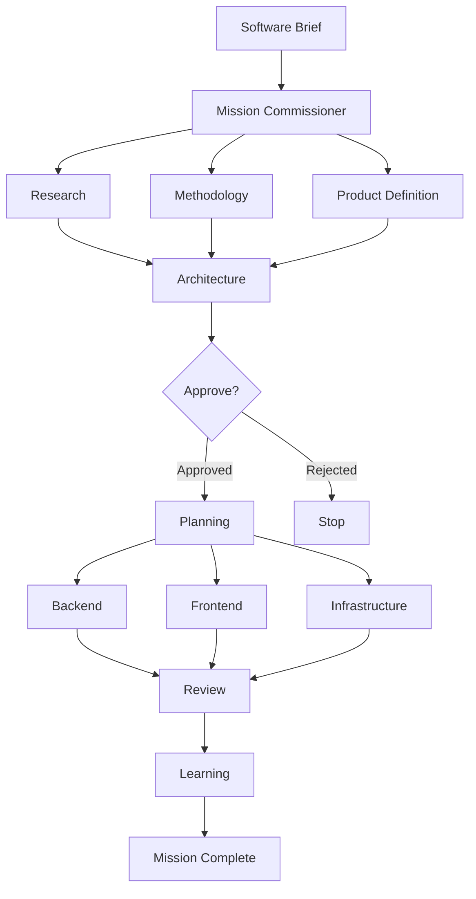
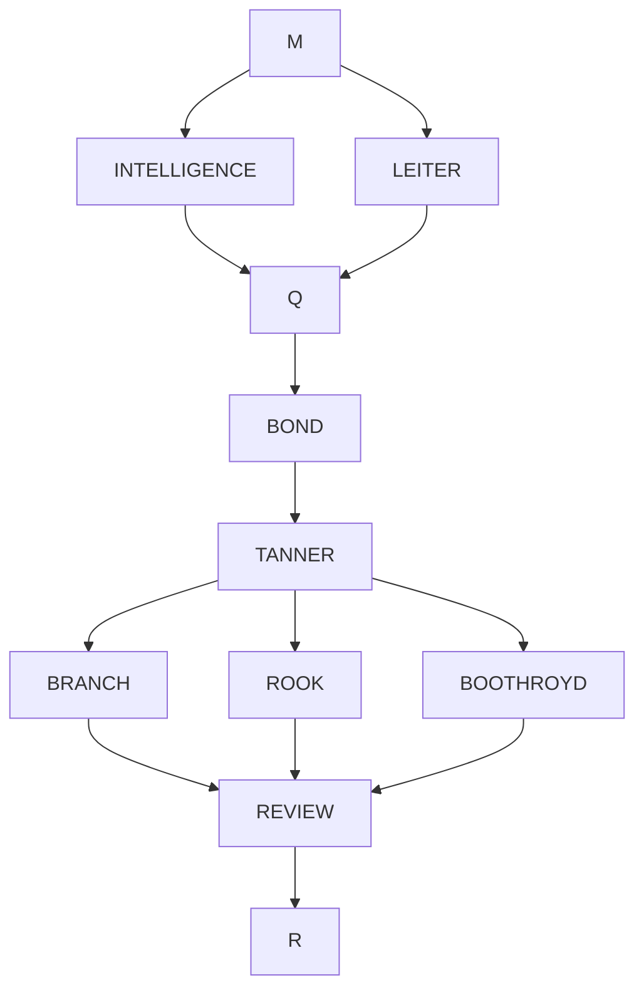
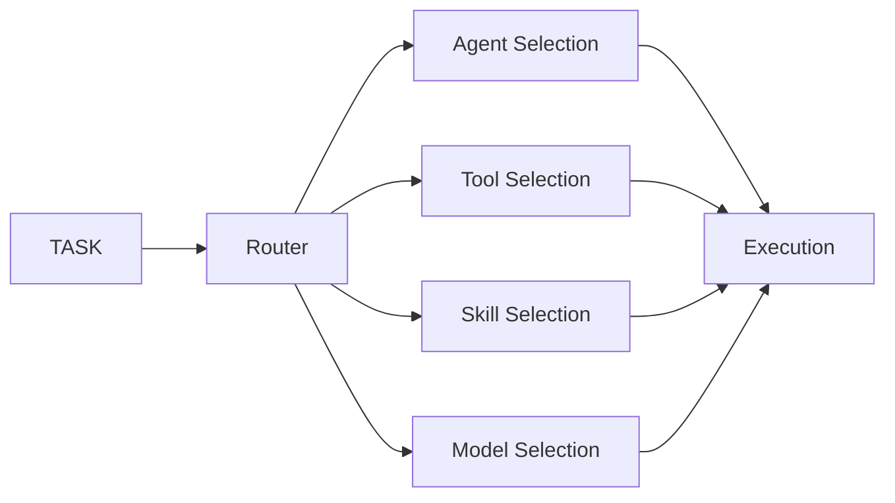
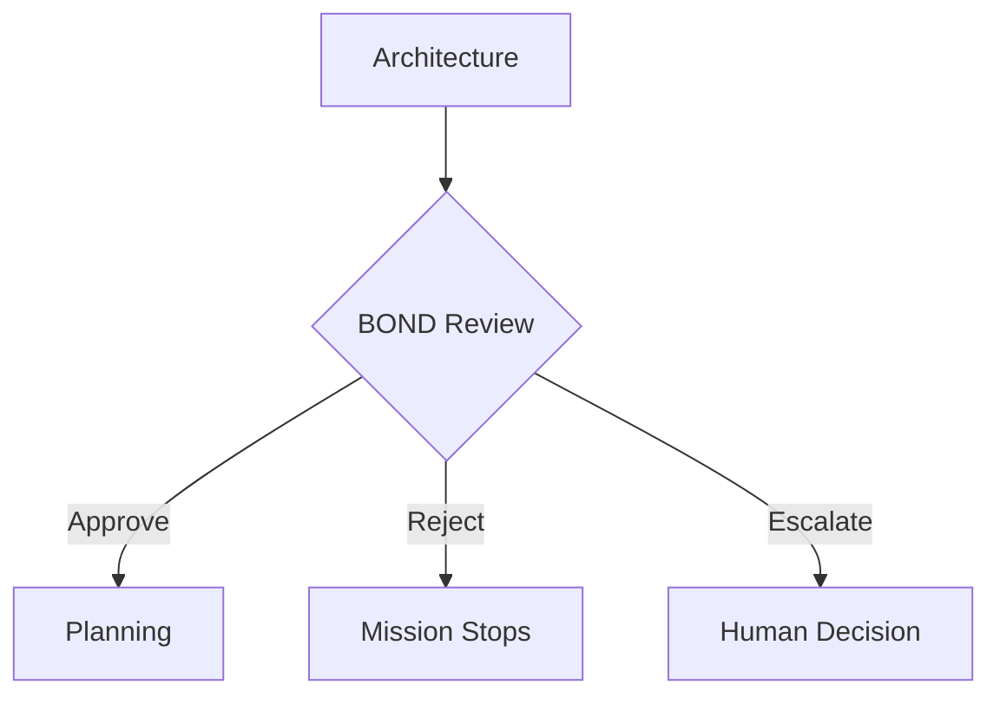
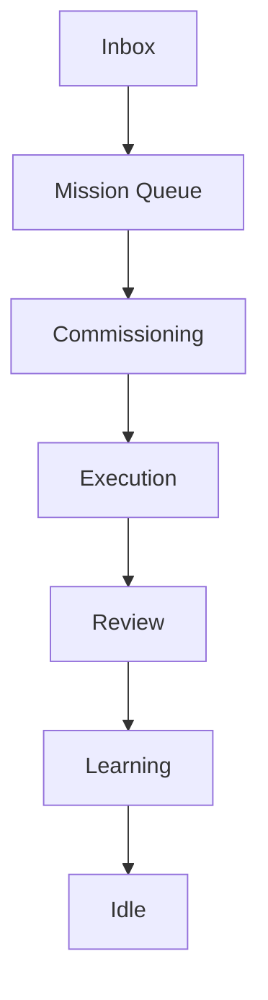
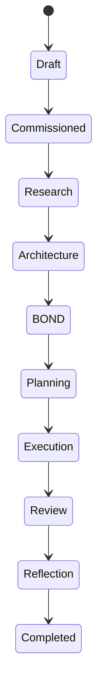

<div align="center">

# CRESSIDA

### Autonomous Multi-Agent Software Engineering Framework

**Transform a plain-English software brief into a production-ready software system.**

From research and architecture to implementation, review, and continuous learning — coordinated by an autonomous team of specialized AI software engineers.

<p align="center">
  <strong>Research</strong> •
  <strong>Architecture</strong> •
  <strong>Planning</strong> •
  <strong>Implementation</strong> •
  <strong>Review</strong> •
  <strong>Learning</strong>
</p>

<p align="center">


</p>

Supports

**Claude Code • Codex • OpenCode • Anthropic • OpenAI • Gemini • Groq • Ollama**

---

**If you find CRESSIDA useful, please consider giving it a star.**

</div>

---

# Overview

Modern coding agents are extremely capable — but they're still fundamentally **single software engineers**. No org structure, no specialization, no dependency management, no architectural review, no accumulated experience.

CRESSIDA assembles a **software engineering organization**: twelve specialized AI roles that collaborate through a full development lifecycle from one plain-English brief.

```
Research → Methodology Analysis → Product Definition → Architecture
  → Human Approval → Planning → Parallel Implementation → Review → Continuous Learning
```

No manual orchestration required.

---

# Demo

```text
# brief.md
Build a production-ready URL shortener.
Requirements: PostgreSQL, Docker, Authentication, REST API, React frontend, Unit tests, CI pipeline
```

```bash
cressida run brief.md
```

```
✓ Market research        ✓ Architecture           ✓ Backend implementation
✓ Technology evaluation  ✓ Dependency graph        ✓ Frontend implementation
✓ Product definition     ✓ Parallel scheduling     ✓ Infrastructure
                                                    ✓ Review  ✓ Learning
Mission Complete
```

---

# Architecture



---

# Why CRESSIDA?

Traditional coding assistants: `User → Prompt → LLM → Code → Prompt → LLM → More Code` — one context, one model, one engineer.

CRESSIDA: `User → Mission Commissioner → Research Team → Architecture Team → Planning Team → Implementation Teams → Review Team → Learning Layer → Mission Complete` — every specialist gets a dedicated role, tools, memory, context, and objectives.

---

# Core Principles

- **Autonomous Software Engineering** — specialized engineers collaborate like a real engineering team, not a single repeatedly-prompted model.
- **Parallel Execution** — independent work runs simultaneously (Research/Methodology/Product Definition together; Backend/Frontend/Infrastructure together). Only genuine dependencies block progress.
- **Mission Commissioning** — every task is analyzed before execution to pick its agent, tools, skills, and model tier, keeping prompts small and focused (see [Mission Commissioning](#mission-commissioning) below).
- **Provider Agnostic** — the same mission runs unchanged on Claude Code, Codex, OpenCode, Anthropic, OpenAI, Gemini, Groq, or Ollama.
- **Human Approval Gates** — BOND reviews the architecture before implementation starts; a mission can continue, reject itself, or escalate to a human before a line of code is written (see [Human Approval Gates](#human-approval-gates)).

---

# Meet the Team

| Agent | Responsibility |
|-------|----------------|
| **M** | Mission commissioner — routing, orchestration, task dispatch |
| **INTELLIGENCE** | Product research, PRDs, market analysis |
| **LEITER** | Methodology research and technology validation |
| **Q** | Software architecture, APIs, system design |
| **BOND** | Autonomous approval gate and architectural review |
| **TANNER** | Planning, dependency graphs, execution scheduling |
| **BRANCH** | Backend implementation |
| **ROOK** | Frontend implementation *(routed dynamically from the backlog)* |
| **BOOTHROYD** | Infrastructure, Docker, deployment *(routed dynamically)* |
| **REVIEW** | Testing, review, quality assurance |
| **R** | Reflection, learning, long-term playbooks |
| **MONEYPENNY** | Mission knowledge management and runtime tracking *(routed dynamically)* |

Every mission always runs M, INTELLIGENCE, LEITER, Q, BOND, TANNER, BRANCH, REVIEW, and R. ROOK/BOOTHROYD/MONEYPENNY only spawn when TANNER's backlog contains matching work (frontend/infra/knowledge tasks respectively).

---

# Agent Pipeline



---

# Mission Commissioning

Before any agent executes, every task is analyzed individually to determine which engineer owns it, which tools and reusable skills it needs, and which model tier its reasoning requires — instead of exposing every tool/skill/model to every agent. Smaller prompts, cheaper execution, better focus.



---

# Continuous Learning

After every completed mission, CRESSIDA reflects on task outcomes, review scores, execution time, and failures — then distills the result into playbooks and reusable skills, not raw conversation history. Repeated lessons strengthen; unused ones decay. Every future mission starts smarter than the last.


---

# Human Approval Gates

Critical architectural decisions deserve review before implementation begins:



Escalated missions wait for a decision:

```bash
cressida resolve-escalation mission_id "Approved"
```

---

# Feature Comparison

| Capability | Traditional Coding Agents | CRESSIDA |
|------------|--------------------------|-----------|
| Multi-Agent Architecture | No | Yes |
| Dependency Graph Execution | No | Yes |
| Parallel Scheduling | No | Yes |
| Dynamic Tool/Model Selection | No | Yes |
| Human Approval Gates | No | Yes |
| Provider Agnostic | Partial | Yes |
| Self Learning | No | Yes |
| MCP Server + Auto-Invoke Skill | Partial | Yes |
| Autonomous Daemon + Scheduling | No | Yes |

---

# Installation

CRESSIDA supports macOS, Linux, Windows, WSL, Docker, and Homebrew — and automatically integrates with **Claude Code**, **opencode**, and **Codex** through MCP, registering itself as an auto-invoked skill in every client that supports one.

## Requirements

| Requirement | Version |
|-------------|----------|
| Python | 3.11+ |
| Git | Latest |
| Claude Code / Codex / OpenCode *(any one, optional)* | Latest |
| Ollama *(optional)* | Latest |

## Quick Install

**macOS / Linux / WSL / Git Bash**

```bash
curl -fsSL https://raw.githubusercontent.com/SlipStream90/Cressida/MI6/install.sh | bash
```

**Windows (PowerShell)**

```powershell
[Net.ServicePointManager]::SecurityProtocol = [Net.ServicePointManager]::SecurityProtocol -bor [Net.SecurityProtocolType]::Tls12
irm https://raw.githubusercontent.com/SlipStream90/Cressida/MI6/install.ps1 | iex
```

Either installer clones CRESSIDA, creates an isolated virtual environment, installs dependencies, registers the MCP server with every client found on your machine (Claude Code, opencode, Codex), installs the auto-invoke skill into Claude Code and Codex, adds CLI commands, and verifies the installation. Restart whichever client(s) you use afterward.

**Homebrew**

```bash
brew tap SlipStream90/cressida && brew install cressida
```

## Manual Installation

```bash
git clone https://github.com/SlipStream90/Cressida.git
cd Cressida
python -m venv .venv
source .venv/bin/activate        # Windows: .venv\Scripts\activate
python onboard.py --provider anthropic --register
```

`--register` configures MCP and installs the auto-invoke skill for every client found on your machine, verifies providers, and prints manual registration commands for anything it couldn't reach automatically.

## Docker

```bash
docker compose up
```

Recommended for CI, self-hosting, and reproducible environments.

---

# Provider Configuration

CRESSIDA automatically detects whichever provider you already use — no configuration changes needed when switching.

**Priority:** `CRESSIDA_PROVIDER` env var → Anthropic/OpenAI/Gemini/Groq API keys → Claude Code CLI → OpenCode CLI → Codex CLI → Ollama

| Provider | Setup |
|---|---|
| Anthropic | `export ANTHROPIC_API_KEY=sk-...` |
| OpenAI | `export OPENAI_API_KEY=sk-...` |
| Gemini | `export GEMINI_API_KEY=...` |
| Groq | `export GROQ_API_KEY=...` |
| Ollama | `ollama serve`, then `--provider ollama --ollama-model qwen2.5` |
| Claude Code | No API key — auto-discovered if logged in. `--provider claude_cli` |
| OpenCode | No API key — auto-discovered if logged in. `--provider opencode` |
| Codex | No API key — auto-discovered if logged in. `--provider codex` |

The three CLI providers each run their own real agentic tool-use loop per task (not a single-shot completion) — Cressida shells out to `claude -p` / `opencode run` / `codex exec` non-interactively and reads back the final result.

---

# Verify Installation

```bash
cressida --help          # run | daemon | dashboard | resolve-escalation | status | learning | ...
```

Inside Claude Code, opencode, or Codex, call `cressida_status` — expect:

```
✓ MCP Server Connected
✓ Provider Detected
✓ Mission Directory Ready
✓ Learning System Ready
```

---

# Your First Mission

```text
# brief.md
Build a production-ready Todo REST API.
Requirements: PostgreSQL, JWT Authentication, Docker, OpenAPI, Unit Tests, CI/CD
```

```bash
cressida run brief.md
```

Run against an existing repository instead of a fresh one with `--project-dir ~/Projects/MyApp` (works on monoliths, microservices, and legacy codebases too — only implementation files are written into the target project; everything else stays under `missions/`).

## Mission Outputs

```
missions/
└── mission_2026_001/
    ├── brief.md
    ├── intelligence/{research_report,PRD,Roadmap,methodology_brief}.md
    ├── ARCHITECTURE.md
    ├── bond_decisions/
    ├── backlog.json
    ├── implementation/
    ├── review_report.md
    └── execution_state.json
```

Every engineering decision is reproducible from what's on disk.

---

# Usage

| Mode | Purpose |
|-------|----------|
| CLI | One-off missions (`cressida run brief.md`) |
| MCP Server | Integrated directly into Claude Code / opencode / Codex |
| Daemon | Fully autonomous background execution |
| Dashboard | Real-time mission monitoring |

```bash
cressida run brief.md --provider openai
cressida run brief.md --project-dir ~/Projects/MyApp
cressida run brief.md --provider ollama --ollama-model qwen2.5
```

---

# MCP Integration

CRESSIDA registers as an MCP server with Claude Code, opencode, and Codex — once installed, every mission can be started without leaving your editor, in whichever of the three you use.

Useful MCP tools: `run_mission()`, `mission_status()`, `mission_progress()`, `learning_playbook()`, `learning_nudge()`, `cressida_status()`

## Auto-invocation (skills)

Claude Code and Codex both support **skills** — description-triggered instructions the agent consults automatically, without you naming CRESSIDA explicitly. `onboard.py --register` installs a `cressida` skill (`skills/cressida/SKILL.md`) into both, so a project-sized build request in an ordinary conversation gets delegated to a mission instead of built turn-by-turn in that session. It falls back to a direct build if the MCP server isn't connected, so a missing/misconfigured server never blocks the conversation.

opencode has no skill mechanism yet, so it gets the equivalent instruction appended to its `AGENTS.md` context file instead.

---

# Daemon Mode

```bash
cressida daemon
cressida daemon --provider anthropic
cressida daemon --poll-interval 5 --status-port 7437
```

Launches the Mission Watcher, Scheduler, Stall Monitor, Status Server, and Learning Engine together.



## Inbox & Scheduled Missions

Drop a YAML file into `missions/inbox/` and the daemon picks it up within seconds — no CLI interaction required:

```yaml
brief: Build a Todo API
priority: high
provider: anthropic
project_dir: ~/Projects/Todo
```

For recurring work (security audits, dependency upgrades, doc generation), drop one into `missions/scheduled/` instead:

```yaml
schedule: "@weekly"   # @hourly | @daily | @weekly | @monthly | ISO timestamp | 5-field cron
brief: Run a security audit
project_dir: ~/Projects/MyApp
```

## Mission Lifecycle



## Monitoring

```bash
cressida dashboard                 # Mission timeline, active agents, progress, stall detection
curl localhost:7437/health         # Daemon status server
curl localhost:7437/status
```

Or poll programmatically: `mission_progress(mission_id="mission_001")` returns current phase, active tasks, recent files, completion %, and stall status.

---

# Obsidian Integration

CRESSIDA optionally mirrors every mission into an Obsidian knowledge graph — research, PRDs, architecture, reviews, decisions, and lessons, automatically synchronized and searchable across every completed mission.


---

# Internal Architecture

```
                         CRESSIDA
                             │
─────────────────────────────┼─────────────────────────────
 Orchestration      Providers            Learning        Runtime
      │                 │                    │              │
 Coordinator      Anthropic/OpenAI/     Reflection      Dashboard
 Dispatcher       Gemini/Groq/Ollama    Playbooks       Daemon
 Scheduler        Claude CLI/OpenCode   Skills          MCP
 Executor         Codex CLI             Reward          Monitoring
 Context                                Memory          Progress
```

Each subsystem is independently replaceable.

```
cressida/
├── agents/            specifications, constitution, prompts
├── orchestration/      coordinator, dispatcher, scheduler, executor, dependency_graph
├── core/providers/     anthropic, openai, gemini, groq, ollama, claude_cli, opencode, codex
├── learning/           reflection, playbooks, skills, rewards, curator
├── skills/             auto-invoke skill (Claude Code / Codex)
├── memory/  knowledge/  missions/  dashboard/  autonomy/  cli/  docs/  tests/
```

---

# Security

Designed around least privilege: dynamic per-task tool exposure, human approval gates, a pre-mission git snapshot for reversibility, a hardcoded dangerous-keyword filter behind BOND's approval (send/publish/delete/merge/push and similar are stripped regardless of what was approved upstream), project-directory validation, and loopback-only local services.

---

# Roadmap

**Near term** — Kubernetes execution backend, distributed mission execution, web UI, VS Code extension, visual dependency graph, mission replay.

**Medium term** — team collaboration, multi-repository missions, remote execution, distributed schedulers, agent marketplace.

**Long term** — reinforcement learning from engineering outcomes, autonomous benchmarking, mission simulation, dynamic agent generation, multi-machine orchestration.

---

# Contributing

1. Open an issue
2. Discuss large architectural changes before starting
3. Ensure all tests pass
4. Follow formatting guidelines

## Development

```bash
git clone https://github.com/SlipStream90/Cressida
python onboard.py
pytest
cressida dashboard   # or: cressida daemon
```

---

# FAQ

**Does CRESSIDA require Claude?** No — Claude Code, Codex, OpenCode, Anthropic, OpenAI, Gemini, Groq, and Ollama are all supported.

**Can I use local models?** Yes, via Ollama.

**Does it work on existing projects?** Yes — pass `--project-dir` and it operates directly on the existing repository.

**Does it remember previous missions?** Yes — engineering experience is distilled into reusable playbooks and skills (see [Continuous Learning](#continuous-learning)).

**Is it autonomous?** Yes — run it interactively via CLI/MCP, or continuously via the daemon's inbox and scheduler.

---

# Citation

```bibtex
@software{cressida2026,
  title={CRESSIDA: Autonomous Multi-Agent Software Engineering Framework},
  author={Aditya Singh},
  year={2026},
  url={https://github.com/SlipStream90/Cressida}
}
```

---

# License

MIT License

---

<div align="center">

## Build software like an engineering organization — not a single chatbot.

If CRESSIDA helps you, consider starring the repository.

</div>
