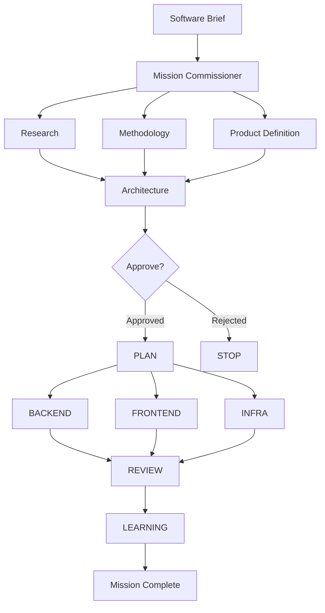
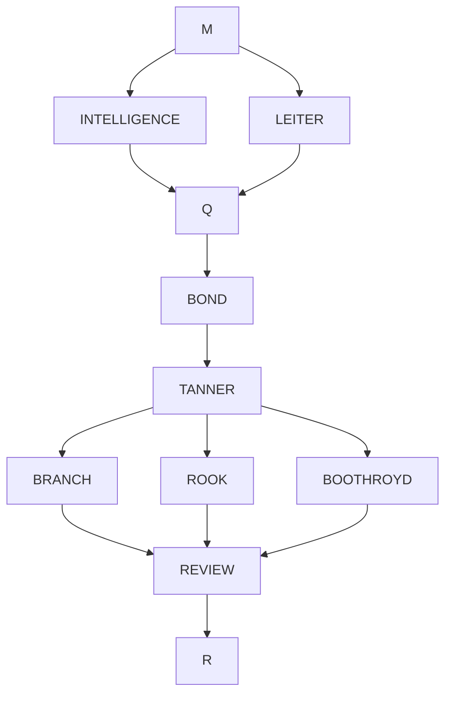
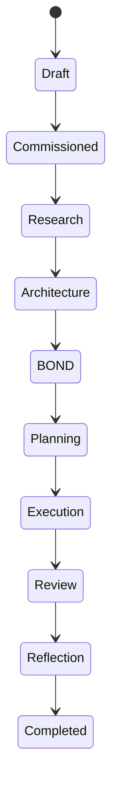
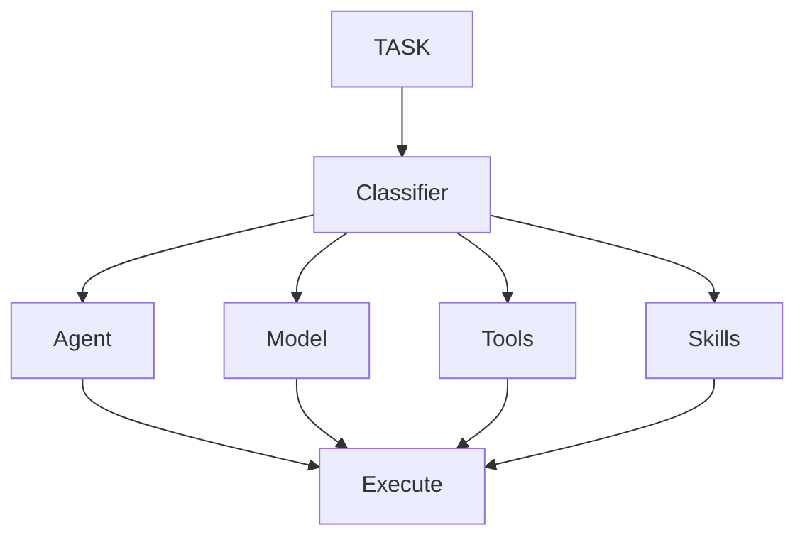
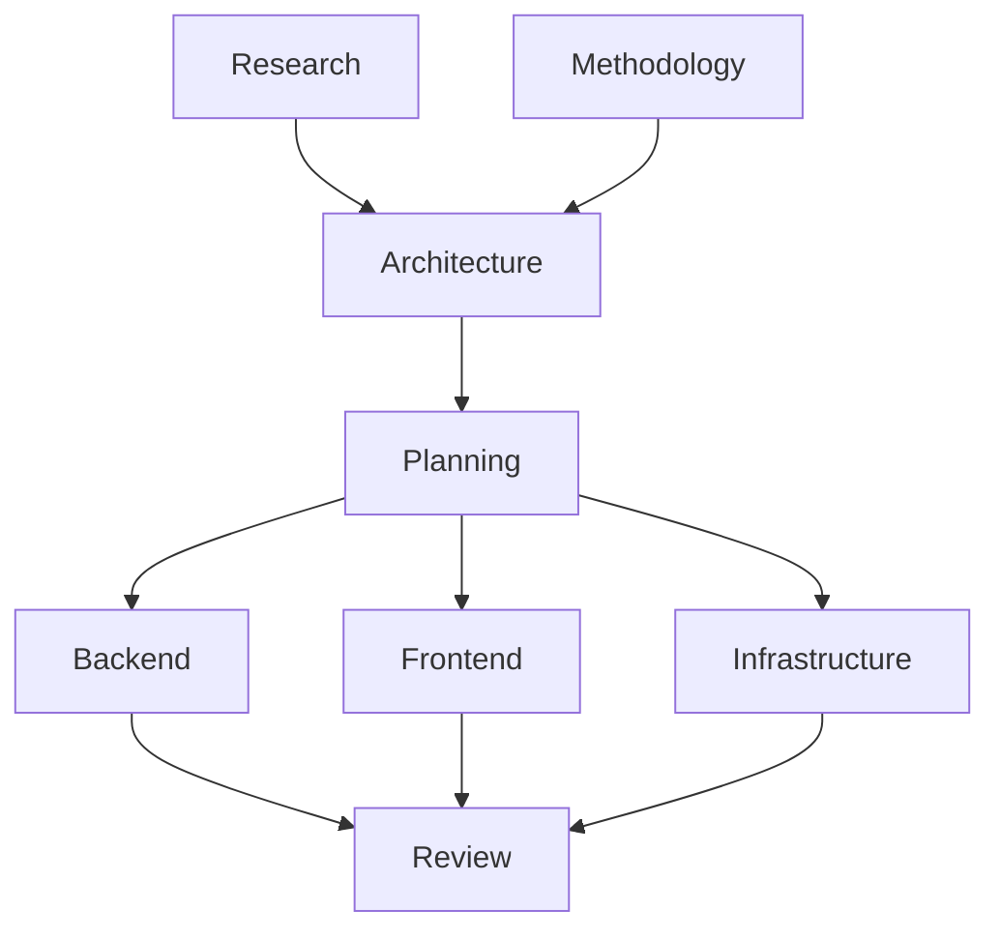

<div align="center">

# 🕵️ CRESSIDA

### Autonomous Multi-Agent Software Engineering Framework

**Transform a plain-English software brief into a production-ready software system.**

From research and architecture to implementation, review, deployment, and continuous learning — all coordinated by an autonomous team of specialized AI software engineers.

<p align="center">
  <strong>Research</strong> •
  <strong>Architecture</strong> •
  <strong>Planning</strong> •
  <strong>Implementation</strong> •
  <strong>Review</strong> •
  <strong>Learning</strong>
</p>

<p align="center">


</p>

Supports

**Claude Code • Anthropic • OpenAI • Gemini • Groq • Ollama • OpenCode**

---

**⭐ If you find CRESSIDA useful, please consider giving it a star.**

</div>

---

# Overview

Modern coding agents are extremely capable.

But they're still fundamentally **single software engineers**.

They have no concept of

- software engineering organizations
- specialization
- planning
- dependency management
- architectural review
- accumulated experience
- autonomous execution

CRESSIDA changes that.

Instead of prompting one LLM repeatedly, CRESSIDA assembles a **software engineering organization** consisting of twelve specialized AI engineers that collaborate to complete an entire software development lifecycle.

A single plain-English brief becomes

```
Research

↓

Methodology Analysis

↓

Product Definition

↓

Architecture

↓

Human Approval

↓

Planning

↓

Parallel Implementation

↓

Review

↓

Continuous Learning
```

without requiring the user to manually orchestrate each step.

---

# Demo

Create a file called `brief.md`

```text
Build a production-ready URL shortener.

Requirements:

• PostgreSQL

• Docker

• Authentication

• REST API

• React frontend

• Unit tests

• CI pipeline
```

Run

```bash
cressida run brief.md
```

CRESSIDA automatically performs

```
✓ Market research

✓ Technology evaluation

✓ Product definition

✓ Architecture

✓ Dependency graph generation

✓ Parallel task scheduling

✓ Backend implementation

✓ Frontend implementation

✓ Infrastructure

✓ Review

✓ Learning

Mission Complete
```

---

# Architecture



---

# Why CRESSIDA?

Traditional coding assistants work like this

```text
User

↓

Prompt

↓

LLM

↓

Code

↓

Prompt

↓

LLM

↓

More Code
```

Everything lives inside one context.

One model.

One conversation.

One engineer.

---

CRESSIDA works like this

```text
User

↓

Mission Commissioner

↓

Research Team

↓

Architecture Team

↓

Planning Team

↓

Implementation Teams

↓

Review Team

↓

Learning Layer

↓

Mission Complete
```

Every specialist has

- a dedicated role
- dedicated tools
- dedicated memory
- dedicated context
- dedicated objectives

---

# Core Principles

## 🧠 Autonomous Software Engineering

CRESSIDA treats software engineering as an organizational problem instead of a prompting problem.

Specialized engineers collaborate exactly like a real engineering team.

---

## ⚡ Parallel Execution

Independent work executes simultaneously whenever dependency analysis allows it.

Research

Methodology

Product Definition

can execute together.

Backend

Frontend

Infrastructure

can execute together.

Only true dependencies block progress.

---

## 🎯 Mission Commissioning

Before any agent executes, CRESSIDA commissions the mission.

Every task is analyzed individually.

For every task CRESSIDA determines

- which agent should execute it
- which tools it needs
- which skills it needs
- which model it should use

This dramatically reduces context size while keeping every task focused.

---

## 💰 Token Efficient

Instead of exposing

- every tool
- every skill
- every model

to every agent,

CRESSIDA only exposes the minimum required resources.

Smaller prompts.

Cheaper execution.

Better focus.

---

## 🌍 Provider Agnostic

Run the exact same mission using

- Claude Code
- Anthropic
- OpenAI
- Gemini
- Groq
- Ollama
- OpenCode

without changing your workflow.

---

## 🛡 Human Approval Gates

Before implementation begins,

BOND reviews the architecture.

A mission can

- continue
- reject itself
- escalate to a human

before writing a single line of code.

---

# Meet the Team

Unlike traditional coding agents, CRESSIDA is composed of specialized software engineers.

| Agent | Responsibility |
|-------|----------------|
| **M** | Mission commissioner, routing, orchestration and task dispatch |
| **INTELLIGENCE** | Product research, PRDs and market analysis |
| **LEITER** | Methodology research and technology validation |
| **Q** | Software architecture, APIs and system design |
| **BOND** | Autonomous approval gate and architectural review |
| **TANNER** | Planning, dependency graphs and execution scheduling |
| **BRANCH** | Backend implementation |
| **ROOK** | Frontend implementation |
| **BOOTHROYD** | Infrastructure, Docker and deployment |
| **REVIEW** | Testing, review and quality assurance |
| **R** | Reflection, learning and long-term playbooks |
| **MONEYPENNY** | Mission knowledge management and runtime tracking |

---

# Agent Pipeline



---

# Mission Commissioning

One of CRESSIDA's defining features is its commissioning layer.

Instead of blindly sending every task to a giant model with every available tool,

every task is optimized before execution.

```mermaid
flowchart LR

TASK

-->

Router

-->

Agent Selection

-->

Tool Selection

-->

Skill Selection

-->

Model Selection

-->

Execution
```

For every task CRESSIDA decides

✅ Which engineer owns the task

✅ Which tools are required

✅ Which reusable skills should be injected

✅ Which model tier satisfies the reasoning requirement

This reduces prompt size while improving execution quality.

---

# Continuous Learning

Every completed mission improves future missions.

```mermaid
flowchart LR

MISSION

-->

Reflection

-->

Distillation

-->

Playbook

-->

Prompt Injection

-->

NEXT MISSION
```

Instead of storing conversations,

CRESSIDA stores distilled engineering experience.

Successful solutions become reusable playbooks.

Repeated lessons become stronger.

Unused lessons decay naturally.

Every future mission benefits from previous ones.

---

# Human Approval Gates

Software engineering shouldn't be fully autonomous.

Critical architectural decisions deserve review.

```mermaid
flowchart TD

Architecture

-->

BOND

BOND -->|Approve| Planning

BOND -->|Reject| Mission Stops

BOND -->|Escalate| Human Decision
```

This prevents poor architectural choices from propagating into implementation.

---

# Feature Comparison

| Capability | Traditional Coding Agents | CRESSIDA |
|------------|--------------------------|-----------|
| Multi-Agent Architecture | ❌ | ✅ |
| Dependency Graph Execution | ❌ | ✅ |
| Parallel Scheduling | ❌ | ✅ |
| Dynamic Tool Selection | ❌ | ✅ |
| Dynamic Model Selection | ❌ | ✅ |
| Human Approval Gates | ❌ | ✅ |
| Provider Agnostic | Partial | ✅ |
| Self Learning | ❌ | ✅ |
| MCP Server | Partial | ✅ |
| CLI | Partial | ✅ |
| Autonomous Daemon | ❌ | ✅ |
| Mission Scheduling | ❌ | ✅ |

---

# What's Next?

The next section covers installation across

- macOS
- Linux
- Windows
- Homebrew
- Manual Installation
- Claude Code
- OpenAI
- Gemini
- Ollama
- OpenCode

followed by complete usage examples.
# Installation

CRESSIDA supports

- macOS
- Linux
- Windows
- WSL
- Docker
- Homebrew

and automatically integrates with **Claude Code** through MCP.

---

# Requirements

| Requirement | Version |
|-------------|----------|
| Python | 3.11+ |
| Git | Latest |
| Claude Code *(optional)* | Latest |
| Ollama *(optional)* | Latest |

---

# Quick Install

## macOS / Linux / WSL / Git Bash

```bash
curl -fsSL https://raw.githubusercontent.com/SlipStream90/Cressida/MI6/install.sh | bash
```

The installer

- clones CRESSIDA
- creates an isolated virtual environment
- installs dependencies
- registers the MCP server
- adds CLI commands
- verifies the installation

Restart Claude Code after installation.

---

## Windows (PowerShell)

```powershell
[Net.ServicePointManager]::SecurityProtocol = [Net.ServicePointManager]::SecurityProtocol -bor [Net.SecurityProtocolType]::Tls12

irm https://raw.githubusercontent.com/SlipStream90/Cressida/MI6/install.ps1 | iex
```

The TLS configuration fixes connection issues on older PowerShell versions.

After installation restart Claude Code.

---

# Homebrew

```bash
brew tap SlipStream90/cressida

brew install cressida
```

The Homebrew formula

- installs CRESSIDA
- creates an isolated Python environment
- installs CLI commands
- prepares MCP integration

Check installation

```bash
brew info cressida
```

---

# Manual Installation

Clone the repository

```bash
git clone https://github.com/SlipStream90/Cressida.git

cd Cressida
```

Create a virtual environment

```bash
python -m venv .venv
```

Linux / macOS

```bash
source .venv/bin/activate
```

Windows

```powershell
.venv\Scripts\activate
```

Install

```bash
python onboard.py --provider anthropic
```

or

```bash
pip install -e ".[anthropic]"
```

The onboarding process

- validates Python
- installs dependencies
- configures MCP
- verifies providers
- prints registration commands

---

# Docker

Docker support is available for running CRESSIDA in isolated environments.

```bash
docker compose up
```

Docker is recommended for

- CI
- self-hosting
- reproducible environments
- development

---

# Provider Configuration

CRESSIDA automatically detects whichever provider you already use.

No configuration changes are required when switching providers.

Priority

```
Environment Variable

↓

Claude Code CLI

↓

OpenCode CLI

↓

Ollama
```

---

## Anthropic

```bash
export ANTHROPIC_API_KEY=sk-...
```

Run

```bash
cressida run brief.md
```

---

## OpenAI

```bash
export OPENAI_API_KEY=sk-...
```

---

## Gemini

```bash
export GEMINI_API_KEY=...
```

---

## Groq

```bash
export GROQ_API_KEY=...
```

---

## Ollama

Start Ollama

```bash
ollama serve
```

Run

```bash
cressida run brief.md --provider ollama
```

Specify a model

```bash
cressida run brief.md --provider ollama --ollama-model qwen2.5
```

---

## Claude Code

No API key required.

If Claude Code is already installed and authenticated

CRESSIDA automatically discovers it.

Run

```bash
cressida run brief.md --provider claude_cli
```

or simply

```bash
cressida run brief.md
```

and provider detection happens automatically.

---

## OpenCode

Already logged in?

Nothing else required.

```bash
cressida run brief.md --provider opencode
```

---

# Verify Installation

Run

```bash
cressida --help
```

Expected output

```
CRESSIDA CLI

run

daemon

dashboard

resolve-escalation

status

learning

...
```

Verify MCP registration

Inside Claude Code

```
cressida_status
```

Expected

```
✓ MCP Server Connected

✓ Provider Detected

✓ Mission Directory Ready

✓ Learning System Ready
```

---

# Your First Mission

Create

```text
brief.md
```

Example

```text
Build a production-ready Todo REST API.

Requirements

• PostgreSQL

• JWT Authentication

• Docker

• OpenAPI

• Unit Tests

• CI/CD
```

Run

```bash
cressida run brief.md
```

CRESSIDA automatically

```
Research

↓

Methodology

↓

Architecture

↓

Planning

↓

Implementation

↓

Review

↓

Learning
```

---

# Project Directory

Run against an existing repository

```bash
cressida run brief.md --project-dir ~/Projects/MyApp
```

or

```bash
cressida run brief.md --project-dir C:\Projects\MyApp
```

CRESSIDA stores

- research
- architecture
- reviews
- mission history

inside the mission directory

while implementation files are written directly into the target project.

---

# Typical Workflow

```mermaid
flowchart LR

Install

-->

Configure Provider

-->

Create Brief

-->

Run Mission

-->

Review Results

-->

Ship
```

---

# Mission Outputs

Each execution generates

```
missions/

└── mission-001/

    ├── Research.md

    ├── Methodology.md

    ├── PRD.md

    ├── Architecture.md

    ├── Planning.md

    ├── Review.md

    ├── Logs/

    ├── Decisions/

    └── Metrics/
```

Everything required to understand the mission is preserved automatically.

---

# Next Steps

The next section covers

- CLI Commands
- MCP Integration
- Daemon Mode
- Mission Scheduling
- Dashboard
- Monitoring
- Obsidian Integration
- Existing Project Workflows
- Autonomous Operation
  # Usage

CRESSIDA supports four primary execution modes.

| Mode | Purpose |
|-------|----------|
| CLI | Execute one-off software engineering missions |
| MCP Server | Integrate directly into Claude Code |
| Daemon | Fully autonomous background execution |
| Dashboard | Monitor mission progress in real time |

---

# Running a Mission

The simplest workflow.

Create a brief

```text
brief.md
```

Example

```text
Build a production-ready REST API for a URL shortener.

Requirements

• PostgreSQL

• JWT Authentication

• Docker

• Unit Tests

• OpenAPI

• CI Pipeline
```

Execute

```bash
cressida run brief.md
```

Mission execution

```text
Mission Started

↓

Research

↓

Methodology

↓

Product Definition

↓

Architecture

↓

BOND Approval

↓

Planning

↓

Parallel Implementation

↓

Review

↓

Reflection

↓

Mission Complete
```

---

# CLI Commands

Run a mission

```bash
cressida run brief.md
```

Specify provider

```bash
cressida run brief.md --provider openai
```

Run against an existing repository

```bash
cressida run brief.md --project-dir ~/Projects/MyApp
```

Specify an Ollama model

```bash
cressida run brief.md \
    --provider ollama \
    --ollama-model qwen2.5
```

---

# MCP Integration

CRESSIDA can be used directly inside Claude Code.

Once installed,

every mission can be started without leaving your editor.

Example

```
Build an authentication system
```

↓

CRESSIDA automatically

- commissions the mission

- builds the dependency graph

- executes specialist agents

- tracks progress

- updates learning

Useful MCP tools

```
run_mission()

mission_status()

mission_progress()

learning_playbook()

learning_nudge()

cressida_status()
```

---

# Daemon Mode

CRESSIDA can operate completely autonomously.

Start the daemon

```bash
cressida daemon
```

Specify provider

```bash
cressida daemon --provider anthropic
```

Custom polling

```bash
cressida daemon \
    --poll-interval 5 \
    --status-port 7437
```

The daemon launches

- Mission watcher

- Scheduler

- Stall monitor

- Status server

- Learning engine

simultaneously.

---

# Autonomous Workflow

```mermaid
flowchart TD

Inbox

-->

Mission Queue

-->

Commissioning

-->

Execution

-->

Review

-->

Learning

-->

Idle
```

---

# Inbox Missions

Drop a YAML file into

```
missions/inbox/
```

Example

```yaml
brief: Build a Todo API

priority: high

provider: anthropic

project_dir: ~/Projects/Todo
```

Within seconds

the daemon discovers it,

creates a mission,

and begins execution.

No CLI interaction required.

---

# Scheduled Missions

Recurring engineering tasks

Security audits

Dependency upgrades

Performance reviews

Documentation generation

can all be scheduled.

Example

```yaml
schedule: "@weekly"

brief: Run a security audit

project_dir: ~/Projects/MyApp
```

Supported

```
@hourly

@daily

@weekly

@monthly

ISO timestamps
```

---

# Mission Lifecycle



---

# Human Approval

Not every mission should continue automatically.

After architecture

BOND evaluates

- system design

- methodology

- implementation plan

Possible outcomes

```
Approve

Reject

Escalate
```

Escalated missions wait for

```bash
cressida resolve-escalation \
    mission_id \
    "Approved"
```

before continuing.

---

# Live Dashboard

Launch

```bash
cressida dashboard
```

Dashboard includes

✅ Mission timeline

✅ Active agents

✅ Current task

✅ Progress bars

✅ File activity

✅ Errors

✅ Stall detection

All refreshed automatically.

---

# Status Server

The daemon exposes

```
localhost:7437
```

Health

```bash
curl localhost:7437/health
```

Status

```bash
curl localhost:7437/status
```

Useful for

- dashboards

- monitoring

- integrations

- automation

---

# Progress Monitoring

Track a mission

```
mission_progress(
    mission_id="mission_001"
)
```

Returns

- Current phase

- Active tasks

- Recent files

- Current agent

- Completion %

- Stall status

No polling logic required.

---

# Existing Projects

CRESSIDA isn't limited to greenfield development.

Run against

- monoliths

- microservices

- legacy systems

- enterprise repositories

Specify

```bash
cressida run \
    brief.md \
    --project-dir ~/Projects/LegacyCRM
```

Mission artifacts remain inside

```
missions/
```

Only implementation files are written into

the target project.

---

# Mission Directory

Every mission is self-contained.

```
missions/

└── mission_2026_001/

    ├── brief.md

    ├── research.md

    ├── methodology.md

    ├── prd.md

    ├── architecture.md

    ├── planning.md

    ├── review.md

    ├── logs/

    ├── metrics/

    ├── learning/

    └── outputs/
```

Nothing is hidden.

Every engineering decision remains reproducible.

---

# Obsidian Integration

CRESSIDA optionally mirrors every mission

into an Obsidian knowledge graph.

Automatically synchronized

- Research

- PRDs

- Architecture

- Reviews

- Decisions

- Lessons

- Mission Logs

Your engineering knowledge becomes searchable

across every completed mission.

---

# Mission Knowledge Flow

```mermaid
flowchart LR

Mission

-->

Artifacts

-->

Knowledge

-->

Playbooks

-->

Skills

-->

Future Missions
```

---

# Typical Workflow

```text
Write Brief

↓

Run Mission

↓

Monitor Dashboard

↓

Approve Architecture

↓

Review Outputs

↓

Merge Changes

↓

Future Missions Become Smarter
```

---

# Multi-Provider Execution

Switch providers instantly

```bash
cressida run brief.md --provider anthropic

cressida run brief.md --provider openai

cressida run brief.md --provider gemini

cressida run brief.md --provider groq

cressida run brief.md --provider ollama
```

No code changes required.

No workflow changes required.

---

# Next

The final section covers

- Deep Architecture

- Commissioning Engine

- Learning System

- Security

- Project Structure

- Roadmap

- Contributing

- Documentation

- FAQ
# Internal Architecture

CRESSIDA is designed as a collection of loosely coupled subsystems rather than a monolithic agent.

```text
                         CRESSIDA

                             │
─────────────────────────────┼─────────────────────────────

 Orchestration      Providers       Learning        Runtime

      │                 │               │              │

 Coordinator      OpenAI          Reflection      Dashboard

 Dispatcher       Anthropic       Playbooks       Daemon

 Scheduler        Claude CLI      Skills          MCP

 Executor         Gemini          Reward          Monitoring

 Context          Groq            Memory          Progress

                  Ollama
```

Each subsystem is independently replaceable.

---

# Project Structure

```text
cressida/

├── agents/
│   ├── specifications
│   ├── constitution
│   └── prompts
│
├── orchestration/
│   ├── coordinator
│   ├── dispatcher
│   ├── scheduler
│   ├── executor
│   └── dependency_graph
│
├── providers/
│   ├── anthropic
│   ├── openai
│   ├── gemini
│   ├── groq
│   ├── ollama
│   └── claude_cli
│
├── learning/
│   ├── reflection
│   ├── playbooks
│   ├── skills
│   ├── rewards
│   └── curator
│
├── memory/
│
├── knowledge/
│
├── missions/
│
├── dashboard/
│
├── autonomy/
│
├── cli/
│
├── docs/
│
└── tests/
```

---

# Commissioning Engine

The commissioning layer is one of CRESSIDA's defining architectural features.

Instead of treating every task equally,

each task is optimized independently.



For every task CRESSIDA determines

- responsible engineer

- reasoning complexity

- cheapest acceptable model

- required tools

- required skills

before execution begins.

---

# Dependency Graph Execution

Unlike sequential coding assistants,

CRESSIDA executes work according to dependency constraints.



Independent work executes simultaneously.

Only genuine dependencies block progress.

---

# Reflection Engine

After every completed mission,

CRESSIDA reflects on execution quality.

Reflection considers

- task outcomes

- review scores

- execution time

- feedback

- failures

- successful patterns

The output becomes

- playbooks

- reusable skills

- engineering heuristics

- anti-patterns

instead of conversation history.

---

# Knowledge System

Knowledge exists across several layers.

```text
Mission

↓

Reflection

↓

Playbook

↓

Skill

↓

Prompt Context

↓

Future Mission
```

Lessons become

- stronger when repeated

- weaker when unused

allowing knowledge to evolve naturally.

---

# Security

CRESSIDA is designed around the principle of least privilege.

Examples include

✅ Dynamic tool exposure

✅ Human approval gates

✅ Provider abstraction

✅ Mission isolation

✅ Project directory validation

✅ Loopback-only local services

✅ Build-failing privacy checks

---

# Design Principles

Every subsystem follows several core principles.

## Minimal Context

Only provide the information required for a task.

---

## Replaceability

Every provider can be swapped without changing orchestration.

---

## Deterministic Orchestration

Dependency graphs determine execution order.

Never prompts.

---

## Human Oversight

Architectural decisions remain reviewable.

---

## Continuous Learning

Experience accumulates across missions.

---

## Provider Independence

No vendor lock-in.

---

# Performance Goals

CRESSIDA is designed to optimize

- prompt size

- execution quality

- engineering consistency

- parallelism

- model utilization

- engineering reuse

rather than maximizing raw model intelligence.

---

# Roadmap

## Near Term

- [ ] Kubernetes execution backend

- [ ] Distributed mission execution

- [ ] Web UI

- [ ] VS Code extension

- [ ] Visual dependency graph

- [ ] Mission replay

---

## Medium Term

- [ ] Team collaboration

- [ ] Multi-repository missions

- [ ] Remote execution

- [ ] Distributed schedulers

- [ ] Agent marketplace

---

## Long Term

- [ ] Reinforcement learning from engineering outcomes

- [ ] Autonomous benchmarking

- [ ] Mission simulation

- [ ] Dynamic agent generation

- [ ] Multi-machine orchestration

---

# Documentation

Detailed documentation is available for

- Agent Specifications

- Architecture

- Commissioning

- Learning

- Memory

- Providers

- Security

- Daemon

- Dashboard

- Obsidian

- MCP

- API Reference

---

# Contributing

Contributions are welcome.

Before opening a pull request please

1. Open an issue

2. Discuss large architectural changes

3. Ensure all tests pass

4. Follow formatting guidelines

---

# Development

Clone

```bash
git clone https://github.com/SlipStream90/Cressida
```

Install

```bash
python onboard.py
```

Run tests

```bash
pytest
```

Start dashboard

```bash
cressida dashboard
```

Start daemon

```bash
cressida daemon
```

---

# Frequently Asked Questions

## Does CRESSIDA require Claude?

No.

It supports multiple providers including

- Anthropic

- OpenAI

- Gemini

- Groq

- Ollama

- Claude Code

- OpenCode

---

## Can I use local models?

Yes.

Ollama is supported out of the box.

---

## Does it work on existing projects?

Yes.

Specify

```bash
--project-dir
```

and CRESSIDA operates directly on existing repositories.

---

## Does it remember previous missions?

Yes.

Engineering experience is distilled into reusable playbooks and skills.

---

## Is it autonomous?

Yes.

CRESSIDA can execute continuously using the daemon scheduler,

or interactively through the CLI and MCP server.

---

# Citation

```bibtex
@software{cressida2026,
  title={CRESSIDA: Autonomous Multi-Agent Software Engineering Framework},
  author={Aditya Singh},
  year={2026},
  url={https://github.com/SlipStream90/Cressida}
}
```

---

# License

MIT License

---

<div align="center">

## Build software like an engineering organization—not a single chatbot.

⭐ If CRESSIDA helps you, consider starring the repository.

</div>
